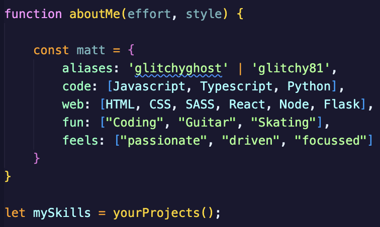

<!-- Custom profile -->

<!-- Readme top-->

<!-- badges -->

 
 
 
 
 

<!-- Profile header -->

<!-- welcome message -->

 <h1>Hello World! My name is Matt Jones. 
 
 </h1>

<!-- animated gif -->
 

 

<!-- about me  -->

<h2 align="center">About Me</h2>
- 👋 Hi, I’m Matt Jones...  I am a freelance Web Designer & Developer from the UK. I am passionate about programming, web developement, creating stylish designs and building user friendly, attractive UI's.
<!-- spacer -->

<!-- syntax about image -->

 <h3></h3>
 

- 👀 I’m interested in eventually becoming a C++ software engineer, but I also really enjoying UI and web design, both front-end and back-end development.  
-     I love coding, problem solving, retro gaming and playing Thrash Metal on my guitar!
-     I am from a creative background, have good experience in music production, 2D animation, game design and vector illustration.
 
- 🌱 I’m currently learning ReactJS, JavaScript, advanced CSS and SCSS.  
-    I am currently enrolled in Harvard's CS50, edX's Front-End Web Developer courses.

- 💞️ I’m looking for freelance opportunites to build amazing things for people, or a role within a fantastic organisation who I can design and create exciting websites and web apps with.
-     I am also interested in collaborating on projects through GitHub to help further our skills and experience, so please do get in touch.
    
- :mailbox:How to reach me: 

 

[stars-shield]: https://img.shields.io/github/stars/matt-jones-developer.svg?style=for-the-badge
[stars-url]: https://matt-jones-developer.github.io/stargazer
[linkedin-shield]: https://img.shields.io/badge/-LinkedIn-black.svg?style=for-the-badge&logo=linkedin&colorB=555
[linkedin-url]: www.linkedin.com/in/matt-jones-zx81
<!---
Matt-Jones-Developer/Matt-Jones-Developer is a ✨ special ✨ repository because its `README.md` (this file) appears on your GitHub profile.
You can click the Preview link to take a look at your changes.
--->
